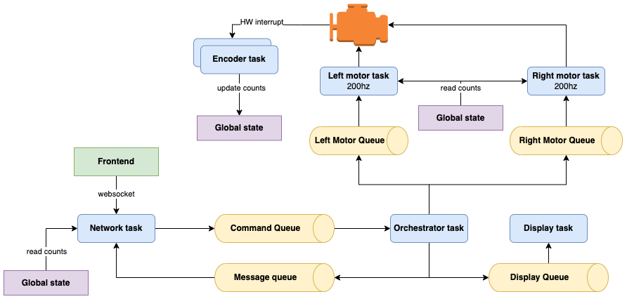
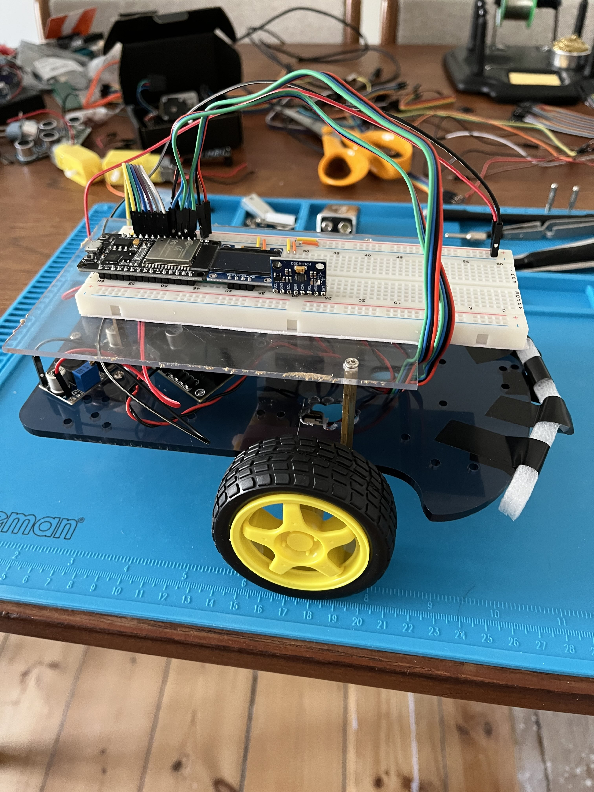

# splinter
This is the repository for my DIY robotics project, which is inspired by the [micromouse](https://en.wikipedia.org/wiki/Micromouse) competition.

## Goals
Here are some of the goals / things I wanted to learn more about while building this project:
* Writing embedded Rust (specifically using [embassy](https://embassy.dev))
* Control theory fundamentals (PID control, etc.)
* Low-level networking (TCP/IP, websockets from scratch, etc.)
* Basic 3D printing and CAD
* Maze solving algorithms (flood fill, etc.)

## Project structure
The project is split into the following main components:
* `frontend/` - frontend for the web app
* `src/` - firmware for the ESP32

## Firmware
The firmware is heavily designed around the [embassy](https://embassy.dev) framework. This means a lot of concurrent workers and synchronization primitives (like channels, mutexes, etc.)

Here's a high-level overview of the firmware:

## Hardware

Here's the hardware I've been using for the project:
* NodeMCU-ESP32
* 2x DFRobot SJ02 motors w/ quadrature encoders
* L298N Motor Driver
* Voltage Regulator (LM2596)
* MPU6050 IMU
* SSD1306 OLED display (for debugging)
* Regular 9V battery